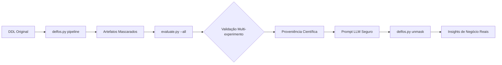

# 🛡️ DELFOS: Analisador, Anonimizador e Validador Científico de DDL

[](https://www.python.org/downloads/)
[](https://opensource.org/licenses/MIT)
[](#)
[](#)

O **DELFOS** é uma ferramenta avançada de engenharia de dados projetada para permitir a análise de arquiteturas de bancos de dados legados por Large Language Models (LLMs) sem comprometer a segurança ou violar a LGPD. Através de um pipeline de anonimização estrutural, o DELFOS transforma DDLs complexos em representações matemáticas isomórficas (hashes), garantindo que a inteligência da topologia permaneça intacta enquanto os dados sensíveis são protegidos.

---

## 🎯 Objetivo do Projeto

Garantir a reprodutibilidade e conformidade no uso de IA para arquitetura de software, permitindo:
1. **Anonimização Radical:** Substituição de identificadores por hashes preservando a lógica relacional.
2. **Validação Científica:** Testes estatísticos (Pearson) para provar que o modelo mascarado é funcionalmente idêntico ao original.
3. **Análise Segura via LLM:** Uso de prompts estratégicos sobre o DDL ofuscado com tradução reversa de insights.

---

## 🏗️ Fluxo de Trabalho (Pipeline)




---

## 🚀 Como Executar

### 1. Instalação
```bash
# Clone o repositório
git clone [https://github.com/seu-usuario/analisador-delfos.git](https://github.com/seu-usuario/analisador-delfos.git)
cd analisador-delfos

# Instale as dependências
pip install -r requirements.txt
pip install sqlglot scipy numpy pyyaml
```

### 2. Executando a Anonimização
O comando abaixo gera o DDL mascarado e o "Cofre de Reversão" (Mapping):
```bash
python delfos.py pipeline seu_schema.sql --output-dir ./output-experimento --mode hash
```

### 3. Validação de Isomorfismo e Efetividade
Execute o avaliador para obter o laudo científico de preservação estrutural:
```bash
python evaluate.py --all
```

---

## 🧪 Validação Científica (Módulo Evaluate)

O DELFOS utiliza o **Score de Relevância Estática (SRE)** para quantificar a importância de cada tabela na topologia.

| Tipo de Experimento | Objetivo | Métrica Principal |
|:--- |:--- |:--- |
| **Isomorfismo** | Preservação da topologia relacional | Correlação de Pearson ($r > 0.95$) |
| **Masking Efficacy** | Efetividade da ofuscação | Ganho de Entropia e Taxa de Substituição |
| **Cardinalidade** | Integridade da contagem de objetos | Comparação exata de entidades |
| **Re-identification Risk** | Risco de reversão/ataque | k-anonymity score |


---

## 🤖 Integração com LLMs (Engenharia de Prompt)

Após a validação, utilize o arquivo `01_masked.sql` para extrair insights arquiteturais. 

**Exemplo de Prompt:**
> *"Atue como um Arquiteto de Dados. Analise o seguinte schema DDL ofuscado. Identifique os 5 principais hotspots baseando-se na densidade de relacionamentos e chaves estrangeiras."*

Para traduzir os nomes mascarados da resposta de volta para o original:
```bash
python delfos.py unmask resposta_llm.md ./output/02_mapping.json --output analise_real.md
```

---

## 📂 Estrutura de Artefatos Gerados

- `01_masked.sql`: DDL pronto para envio ao LLM.
- `02_mapping.json`: Chave privada para desmascaramento (NUNCA compartilhe).
- `03_structure_masked.json`: Metadados da topologia ofuscada.
- `provenance_*.md`: Relatório de proveniência para auditoria científica.

---

## ⚖️ Metodologia e Conformidade

Este projeto segue os princípios da **Design Science Research (DSR)**, focando na criação de artefatos que resolvem problemas práticos (segurança de dados) com rigor acadêmico. 

- **LGPD:** Garante que metadados que possam identificar processos de negócio sejam removidos.
- **Isomorfismo:** Mantém a assinatura geométrica do grafo de tabelas.


```

