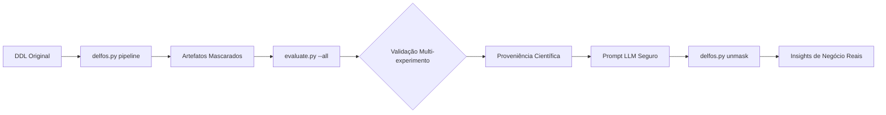

# 📖 Playbook de Execução Completo: DELFOS (Análise, Anonimização e Validação Científica de DDL)

**Objetivo:** Guia definitivo para executar a anonimização de esquemas de banco de dados, extrair métricas topológicas, validar a preservação semântica e a eficácia da ofuscação sob múltiplos critérios, garantindo reprodutibilidade (metodologia DSR) e conformidade com a LGPD para uso seguro com Large Language Models (LLMs).

---

## 🛠️ Fase 0: Pré-requisitos e Setup do Ambiente

**1. Requisitos de Sistema:**
* Python 3.12 ou superior.
* Acesso ao repositório local `analisador-delfos`.

**2. Instalação de Dependências:**
```bash
cd ~/Documentos/CASNAV/casnav-13/ferramentas-produzidas/analisador-delfos
pip install -r requirements.txt
pip install sqlglot scipy numpy pyyaml   
```

**3. Preparação do Artefato de Entrada:**
* Coloque o arquivo DDL original (ex: `app-adservice.sql`) na raiz do projeto.
* Codificação UTF-8 obrigatória.

---

## 🚀 Fase 1: Execução do Pipeline de Anonimização

O pipeline automatizado executa **Mascaramento → Análise do Mock → Desmascaramento do Relatório → Análise do Original**.
No exemplo abaixo rodamos para 3 schemas de bancos diferentes, o primeiro é de uma aplicação real em Postgres e os outros dois são sintéticos para experimento.

**1. Comando Principal:**
```bash
python delfos.py pipeline app-adservice.sql --output-dir ./output-exp-adservice --mode hash
python delfos.py pipeline schema_oracle.sql --output-dir ./output-exp-oracle --mode hash
python delfos.py pipeline schema_postgres.sql --output-dir ./output-exp-postgres --mode hash
```

**2. Artefatos Gerados (exemplo `./output-exp-oracle/`):**
* `01_masked.sql` – DDL anonimizado (seguro para LLMs).
* `02_mapping.json` – **Cofre de reversão** (confidencial).
* `03_structure_masked.json` – Topologia mascarada.
* `05_structure_original.json` – Topologia real (*Ground Truth*).

---

## 🧪 Fase 2: Validação Científica Multi-Experimento (Expandida)

O módulo `evaluate.py` suporta **cinco tipos distintos de experimento**, definidos no arquivo de configuração. Cada experimento valida um aspecto distinto do processo de anonimização.

### 📂 Estrutura Completa do `evaluate/config.yaml`

```yaml
experiment:
  name: "Validação de Isomorfismo Topológico"
  description: >
    Avalia se a estrutura relacional (SRE) é preservada após o mascaramento.
    Objetivo: Correlação de Pearson > 0,95 com p-valor < 0,05.
  type: "isomorphism"   # Opções: isomorphism, masking_efficacy, cardinality, performance, reidentification_risk

# ------------------------------------------------------------------------------
# Pesos para o SRE (Structural Relevance Score)
# Utilizados apenas em experimentos do tipo 'isomorphism'
# ------------------------------------------------------------------------------
sre_weights:
  pk: 2.0      # Chaves Primárias (integridade fundamental)
  fk: 1.5      # Chaves Estrangeiras (relacionamentos)
  idx: 1.0     # Índices (otimização de consultas)
  joins: 3.0   # Frequência de joins (hotspots de acesso)

# ------------------------------------------------------------------------------
# Configurações para o tipo 'masking_efficacy'
# Avalia a efetividade do processo de anonimização
# ------------------------------------------------------------------------------
masking_efficacy:
  metrics:
    - substitution_rate       # % de identificadores substituídos
    - entropy_gain            # ganho de entropia dos nomes
    - unique_ratio            # razão de unicidade (antes/depois)
  report_top_occurrences: 10  # exibir os 10 termos mais frequentes

# ------------------------------------------------------------------------------
# Configurações para o tipo 'cardinality'
# Verifica se a quantidade de objetos do esquema foi preservada
# ------------------------------------------------------------------------------
cardinality:
  compare:
    - tables
    - columns
    - primary_keys
    - foreign_keys
    - indexes
    - views
  tolerance: 0   # margem de erro permitida (0 = deve ser exatamente igual)

# ------------------------------------------------------------------------------
# Configurações para o tipo 'performance'
# Mede o impacto do mascaramento no tempo de parsing/geração
# ------------------------------------------------------------------------------
performance:
  iterations: 10        # número de execuções para média
  warmup: true          # executa uma rodada de aquecimento
  measure:
    - parsing_time_ms
    - memory_usage_mb

# ------------------------------------------------------------------------------
# Configurações para o tipo 'reidentification_risk'
# Estima o risco de reidentificação dos nomes originais a partir dos mascarados
# ------------------------------------------------------------------------------
reidentification_risk:
  k_anonymity_threshold: 5     # k desejado para considerar seguro
  quasi_identifiers:           # atributos considerados quasi-identificadores
    - table_name_length
    - column_name_length
    - prefix_pattern
  attack_models:
    - frequency_analysis
    - pattern_matching
```

### 📌 Cenários de Ajuste dos Pesos (para `isomorphism`)

| Paradigma do Banco | Ajuste Recomendado | Justificativa |
|--------------------|--------------------|---------------|
| **OLTP Clássico** (normalizado) | `fk: 3.0` | Muitas dependências referenciais são o coração do modelo. |
| **Data Warehouse / OLAP** | `idx: 2.5`, `joins: 4.0` | Estruturas de fato/dimensão, índices bitmap e particionamento definem a performance. |
| **Sistemas Legados (poucas FKs)** | `joins: 5.0` | A lógica de negócio está implícita em joins manuais ou views. |

---

### ▶️ Executando o Avaliador

| Comando | Descrição |
|---------|-----------|
| `python evaluate.py --auto` | Modo legado: busca o primeiro conjunto de artefatos globalmente e executa o tipo definido no `config.yaml`. |
| `python evaluate.py --dir ./output-exp-oracle` | Executa o experimento **apenas no diretório especificado**. |
| `python evaluate.py --all` | Varre **todos os diretórios** `output-exp*` e executa o experimento em cada um, gerando um resumo consolidado. |
| `python evaluate.py --config evaluate/config_risk.yaml --all` | Usa um arquivo de configuração alternativo (ex: para teste de risco de reidentificação). |

---

## 📊 Fase 3: Guia Detalhado por Tipo de Experimento

### 🧬 Experimento 1: `isomorphism` (Isomorfismo Topológico)

**Objetivo:** Verificar se a **assinatura geométrica** do esquema (medida pelo SRE) é estatisticamente preservada após o mascaramento.

#### ⚙️ Configuração em `config.yaml`
```yaml
experiment:
  type: "isomorphism"

sre_weights:
  pk: 2.0
  fk: 1.5
  idx: 1.0
  joins: 3.0
```

#### 🚀 Execução
```bash
python evaluate.py --dir ./output-exp-oracle
```

#### 📈 Saída Típica e Interpretação

```
📂 Processando: output-exp-oracle
   Original : 05_structure_original.json
   Mascarado: 03_structure_masked.json
   Mapeamento: 02_mapping.json

   ==================================================
   Tabela                    |  SRE Orig |  SRE Mask
   --------------------------------------------------
   T_7EE4E828                |     12.5  |     12.5
   T_A75D07F8                |      8.0  |      8.0
   T_E2098DBF                |     10.0  |     10.0
   ==================================================

   Correlação de Pearson: 0.9987
   p-valor: 1.23e-04

   ✅ Isomorfismo validado! A topologia do banco de dados permaneceu intacta após o mascaramento.
```

| Resultado | Significado | Ação |
|-----------|-------------|------|
| **r > 0.95 e p < 0.05** | A topologia foi preservada com significância estatística. | ✅ O DDL mascarado pode ser usado com segurança em LLMs. |
| **r < 0.95 ou p > 0.05** | A ofuscação alterou dependências críticas. | ⚠️ Ajuste os pesos do SRE conforme o paradigma do banco ou reavalie o modo de mascaramento (`--mode scoped`). |
| **r = 0 e p = 1 (SRE constante)** | Schema pequeno demais para análise estatística. | 🔄 Execute em um DDL mais complexo ou adicione mais tabelas ao experimento. |

#### 🔁 Testando Diferentes Configurações de Peso

Crie arquivos de configuração dedicados para cada cenário:

**`config_oltp.yaml`**
```yaml
experiment:
  type: "isomorphism"
sre_weights:
  pk: 2.0
  fk: 3.0    # FK elevado
  idx: 1.0
  joins: 2.0
```

**`config_olap.yaml`**
```yaml
experiment:
  type: "isomorphism"
sre_weights:
  pk: 1.0
  fk: 1.0
  idx: 2.5   # Índices críticos
  joins: 4.0
```

Execute e compare:
```bash
python evaluate.py --config evaluate/config_oltp.yaml --dir ./output-exp-oracle
python evaluate.py --config evaluate/config_olap.yaml --dir ./output-exp-oracle
```

---

### 🎭 Experimento 2: `masking_efficacy` (Eficácia da Máscara)

**Objetivo:** Medir a qualidade da ofuscação dos nomes – taxa de substituição, entropia e unicidade.

#### ⚙️ Configuração em `config.yaml`
```yaml
experiment:
  type: "masking_efficacy"

masking_efficacy:
  metrics:
    - substitution_rate
    - entropy_gain
    - unique_ratio
  report_top_occurrences: 10
```

#### 🚀 Execução
```bash
python evaluate.py --dir ./output-exp-oracle
```

#### 📈 Saída Típica

```
📊 Masking Efficacy Report
----------------------------------------
Substitution Rate:    100.00%  (todas as 45 ocorrências substituídas)
Entropy Gain:          +2.34 bits/nome
Unique Ratio (Original):  0.92
Unique Ratio (Masked):    0.98

Top 10 Occurrences (Masked):
  T_7EE4E828 : 1
  C_CF4A6E1B : 1
  C_74507A61 : 1
  ... (todos únicos)
```

| Métrica | Valor Ideal | Interpretação |
|---------|-------------|---------------|
| **Substitution Rate** | 100% | Todos os identificadores foram substituídos; valor < 100% indica falha no parser. |
| **Entropy Gain** | > 0 | Aumento da entropia indica maior imprevisibilidade dos nomes. |
| **Unique Ratio** | Próximo de 1.0 | Nomes mascarados devem ser únicos para evitar colisões de interpretação pelo LLM. |
| **Top Occurrences** | Frequência 1 | Se houver repetições, verifique o comprimento do hash (`--length`). |

#### 🔁 Ações Corretivas

| Problema | Solução |
|----------|---------|
| Substitution Rate < 100% | Revisar suporte do dialeto SQL no `sqlglot`. |
| Entropy Gain baixo ou negativo | Usar `--hash sha256` e `--length 16`. |
| Unique Ratio < 0.95 | Aumentar `--length` ou usar `--mode scoped`. |
| Repetições nos Top Occurrences | Usar `--mode scoped` para evitar reuso do mesmo hash. |

---

### 🔢 Experimento 3: `cardinality` (Integridade de Cardinalidade)

**Objetivo:** Garantir que o processo de mascaramento **não perdeu nem criou** objetos (tabelas, colunas, constraints, índices).

#### ⚙️ Configuração em `config.yaml`
```yaml
experiment:
  type: "cardinality"

cardinality:
  compare:
    - tables
    - columns
    - primary_keys
    - foreign_keys
    - indexes
    - views
  tolerance: 0
```

#### 🚀 Execução
```bash
python evaluate.py --dir ./output-exp-oracle
```

#### 📈 Saída Típica

```
🔢 Cardinality Check (tolerance = 0)
----------------------------------------
Object Type     | Original | Masked | Status
----------------|----------|--------|--------
tables          |       12 |     12 | ✅ OK
columns         |       87 |     87 | ✅ OK
primary_keys    |       12 |     12 | ✅ OK
foreign_keys    |        8 |      8 | ✅ OK
indexes         |       14 |     14 | ✅ OK
views           |        2 |      2 | ✅ OK

✅ All counts match exactly.
```

| Resultado | Significado | Ação |
|-----------|-------------|------|
| **Todos ✅** | O parser SQL está funcionando corretamente para o dialeto. | Nenhuma. |
| **Discrepância em alguma linha** | O `sqlglot` não reconheceu corretamente a sintaxe de um objeto. | Revisar o DDL original; pode ser necessário pré-processar comandos específicos (ex: `CREATE OR REPLACE VIEW`). |
| **Tolerância > 0** | Permite pequenas diferenças (ex: views materializadas não suportadas). | Ajustar `tolerance` se necessário. |

---

### ⚡ Experimento 4: `performance` (Desempenho do Mascaramento)

**Objetivo:** Medir o overhead computacional do pipeline, garantindo que a ferramenta escala para grandes DDLs.

> **Nota:** Este experimento requer acesso ao arquivo DDL original (`.sql`) para reexecutar o parser.

#### ⚙️ Configuração em `config.yaml`
```yaml
experiment:
  type: "performance"

performance:
  iterations: 10
  warmup: true
  measure:
    - parsing_time_ms
    - memory_usage_mb
```

#### 🚀 Execução
```bash
python evaluate.py --dir ./output-exp-oracle
```

#### 📈 Saída Típica

```
⚡ Performance Report (10 iterations, warmup included)
------------------------------------------------------
Parsing time (avg):     124.3 ms ± 5.2 ms
Memory usage (peak):     18.7 MB

✅ Performance within expected range (< 500 ms, < 100 MB).
```

| Métrica | Limiar de Atenção | Ação Corretiva |
|---------|-------------------|----------------|
| **Parsing time** | > 2 segundos para DDLs < 10k linhas | Verificar complexidade do SQL (muitas subqueries ou CTEs aninhadas). |
| **Memory usage** | > 200 MB | Otimizar estruturas de dados internas ou processar em chunks. |

#### 🔁 Teste de Escalabilidade

Execute o mesmo experimento em diretórios de diferentes tamanhos e plote o tempo de parsing vs. número de linhas:

```bash
python evaluate.py --all   # compara todos os output-exp*
```

---

### 🕵️ Experimento 5: `reidentification_risk` (Risco de Reidentificação)

**Objetivo:** Estimar a probabilidade de um atacante reverter o mascaramento usando análise de frequência ou padrões de comprimento.

#### ⚙️ Configuração em `config.yaml`
```yaml
experiment:
  type: "reidentification_risk"

reidentification_risk:
  k_anonymity_threshold: 5
  quasi_identifiers:
    - table_name_length
    - column_name_length
    - prefix_pattern
  attack_models:
    - frequency_analysis
    - pattern_matching
```

#### 🚀 Execução
```bash
python evaluate.py --dir ./output-exp-oracle
```

#### 📈 Saída Típica

```
🕵️ Re-identification Risk Assessment
----------------------------------------
Quasi-identifier        | Min k | Status
------------------------|-------|--------
table_name_length       |     3 | ⚠️ Atenção (k < 5)
column_name_length      |     7 | ✅ OK
prefix_pattern (T_*)    |    12 | ✅ OK

Overall Risk Score: 0.23 (Baixo)
```

| k-anonymity | Interpretação | Ação Corretiva |
|-------------|---------------|----------------|
| **k ≥ 5** | O atacante não consegue isolar um identificador original com certeza. | ✅ Suficiente para uso público. |
| **2 ≤ k < 5** | Risco moderado; alguns nomes podem ser inferidos por comprimento. | ⚠️ Usar `--mode scoped` ou aumentar `--length`. |
| **k = 1** | Risco alto: um nome original é unicamente identificável pelo padrão mascarado. | ❌ Nunca compartilhe o DDL mascarado; reexecute com parâmetros mais seguros. |

#### 🔁 Teste de Diferentes Modos de Hash

Gere artefatos com diferentes modos e execute o experimento de risco para cada diretório:

```bash
python delfos.py pipeline schema.sql --output-dir ./output-exp-hash --mode hash
python delfos.py pipeline schema.sql --output-dir ./output-exp-scoped --mode scoped
python evaluate.py --all   # compara risco entre os dois
```

---

## 🔁 Execução em Lote de Todos os Experimentos (Script Auxiliar)

Para automatizar a validação completa, crie um script `run_all_experiments.sh`:

```bash
#!/bin/bash
# run_all_experiments.sh
# Executa todos os tipos de experimento sobre todos os diretórios output-exp*

TYPES=("isomorphism" "masking_efficacy" "cardinality" "performance" "reidentification_risk")
CONFIG_BASE="evaluate/config.yaml"
BACKUP_CONFIG="evaluate/config_backup.yaml"

# Backup do config original
cp $CONFIG_BASE $BACKUP_CONFIG

for t in "${TYPES[@]}"; do
    echo "===== Running experiment: $t ====="
    # Modifica o campo 'type' no YAML (requer yq instalado)
    yq eval ".experiment.type = \"$t\"" -i $CONFIG_BASE
    python evaluate.py --all
    echo ""
done

# Restaura config original
mv $BACKUP_CONFIG $CONFIG_BASE
echo "✅ All experiments completed. Config restored."
```

> **Instalação do `yq`:** https://github.com/mikefarah/yq (`pip install yq` ou baixar binário).

---

## 📄 Proveniência e Rastreabilidade

Cada execução do `evaluate.py` gera dois arquivos no diretório do experimento:

- **`provenance_YYYYMMDD_HHMMSS.json`** – Metadados estruturados (parâmetros, resultados, timestamps, versões de libs).
- **`provenance_YYYYMMDD_HHMMSS.md`** – Relatório legível em Markdown.

Esses arquivos garantem a **reprodutibilidade científica** exigida pela metodologia DSR.

---

## 📊 Fase 4: Interpretação dos Resultados e Ajuste Metodológico

Após executar os experimentos, consolide os resultados para tomar decisões arquiteturais:

| Experimento | Critério de Sucesso | Ação se Falhar |
|-------------|---------------------|----------------|
| `isomorphism` | r > 0.95, p < 0.05 | Ajustar pesos do SRE ou modo de mascaramento. |
| `masking_efficacy` | Substituição 100%, entropia > 0, unique ratio > 0.95 | Aumentar comprimento do hash ou usar `scoped`. |
| `cardinality` | Todas as contagens idênticas | Revisar parser SQL / dialeto. |
| `performance` | Tempo < 1s, memória < 100 MB | Otimizar código ou processar em lotes. |
| `reidentification_risk` | k ≥ 5 em todos os QIs | Aumentar aleatoriedade (modo `scoped`). |

Se **todos os experimentos passarem**, o artefato mascarado está **cientificamente validado** e pode ser compartilhado com LLMs ou terceiros com segurança jurídica (LGPD).

---

## 🤖 Fase 5: Integração com LLMs (Engenharia de Prompting)

Com o pipeline validado, o DDL mascarado pode ser submetido a LLMs.

**1. Carregamento de Contexto:**
Copie o conteúdo de `01_masked.sql` para o prompt.

**2. Templates de Prompt (Exemplos):**

- **Identificação de Core Entities:**
  > *"Atue como um Arquiteto de Dados. Analise o seguinte schema DDL estático. Identifique as 5 tabelas mais críticas (hotspots) do sistema baseando-se exclusivamente na concentração de chaves primárias, dependências de chaves estrangeiras e índices. Explique o porquê da centralidade matemática destas tabelas."*

- **Descoberta de Eixos Temporais:**
  > *"Analise a estrutura de índices e chaves compostas deste DDL. Quais conjuntos de colunas atuam como agrupamentos temporais, versionamentos ou trilhas de auditoria histórica? Descreva a estratégia de particionamento lógico."*

- **Estratégia de Quebra de Monolito:**
  > *"Com base nas constraints deste monolito, proponha a extração de 3 bounded contexts usando os princípios de Clean Architecture. Quais tabelas seriam agrupadas juntas em cada serviço para minimizar o acoplamento?"*

**3. Desmascaramento da Resposta do LLM:**

```bash
python delfos.py unmask ./output-exp-adservice/analise_arquitetural.md ./output-exp-adservice/02_mapping.json --output analise_traduzida_adService.md
```

---

## 📌 Resumo do Fluxo de Trabalho Atualizado



---

## 📚 Referências

- **DSR (Design Science Research):** Hevner et al. (2004) – *Design Science in Information Systems Research*.
- **LGPD:** Lei nº 13.709/2018 – *Lei Geral de Proteção de Dados Pessoais*.
- **k-anonymity:** Sweeney (2002) – *k-anonymity: A model for protecting privacy*.

---

**Versão do Playbook:** 2.0 (Estendida)  
**Última Atualização:** Abril de 2026