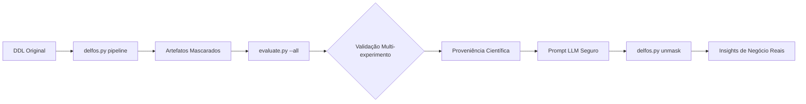

# 📖 Playbook de Execução Completo: DELFOS  (Análise, Anonimização e Validação Científica de DDL)

**Objetivo:** Guia definitivo para executar a anonimização de esquemas de banco de dados, extrair métricas topológicas, validar a preservação semântica e a eficácia da ofuscação sob múltiplos critérios, garantindo reprodutibilidade (metodologia DSR) e conformidade com a LGPD para uso seguro com Large Language Models (LLMs).

---

## 🛠️ Fase 0: Pré-requisitos e Setup do Ambiente

**1. Requisitos de Sistema:**
* Python 3.12 ou superior.
* Acesso ao repositório local `analisador-delfos`.

**2. Instalação de Dependências:**
```bash
cd ~/Documentos/CASNAV/casnav-13/ferramentas-produzidas/analisador-delfos
pip install -r requirements.txt
pip install sqlglot scipy numpy pyyaml   
```

**3. Preparação do Artefato de Entrada:**
* Coloque o arquivo DDL original (ex: `app-adservice.sql`) na raiz do projeto.
* Codificação UTF-8 obrigatória.

---

## 🚀 Fase 1: Execução do Pipeline de Anonimização

O pipeline automatizado executa **Mascaramento → Análise do Mock → Desmascaramento do Relatório → Análise do Original**.
No exemplo abaixo rodamos para 3 schemas de bancos diferentes, o primeiro é deum aplicação real em Postgres e os outros dois são sinteticos para experimento
**1. Comando Principal:**
```bash
python delfos.py pipeline app-adservice.sql --output-dir ./output-exp-adservice --mode hash
python delfos.py pipeline schema_oracle.sql --output-dir ./output-exp-oracle --mode hash
python delfos.py pipeline schema_postgres.sql --output-dir ./output-exp-postgres --mode hash
```

**2. Artefatos Gerados (exemplo `./output-exp-oracle/`):**
* `01_masked.sql` – DDL anonimizado (seguro para LLMs).
* `02_mapping.json` – **Cofre de reversão** (confidencial).
* `03_structure_masked.json` – Topologia mascarada.
* `05_structure_original.json` – Topologia real (*Ground Truth*).

---

## 🧪 Fase 2: Validação Científica Multi-Experimento

O módulo `evaluate.py` agora suporta **múltiplos tipos de experimento**, definidos no arquivo de configuração. Cada experimento valida um aspecto distinto do processo de anonimização.

### 📂 Estrutura do `evaluate/config.yaml` (Expandida)

```yaml
experiment:
  name: "Validação de Isomorfismo Topológico"
  description: >
    Avalia se a estrutura relacional (SRE) é preservada após o mascaramento.
    Objetivo: Correlação de Pearson > 0,95 com p-valor < 0,05.
  type: "isomorphism"   # Opções: isomorphism, masking_efficacy, cardinality, performance, reidentification_risk

sre_weights:            # Pesos para o cálculo do SRE (usado em 'isomorphism')
  pk: 2.0
  fk: 1.5
  idx: 1.0
  joins: 3.0

# Configurações específicas para outros tipos de experimento
masking_efficacy:
  metrics: [substitution_rate, entropy_gain, unique_ratio]
  report_top_occurrences: 10

cardinality:
  compare: [tables, columns, primary_keys, foreign_keys, indexes, views]
  tolerance: 0

performance:
  iterations: 10
  warmup: true
  measure: [parsing_time_ms, memory_usage_mb]

reidentification_risk:
  k_anonymity_threshold: 5
  quasi_identifiers: [table_name_length, column_name_length, prefix_pattern]
  attack_models: [frequency_analysis, pattern_matching]
```

** Cenários de Ajuste:**
* **Bancos Normalizados (OLTP Clássico):** Alta dependência de integridade referencial. Aumente o peso das FKs (`fk: 3.0`).
* **Bancos Analíticos (Data Warehouse/OLAP):** Tabelas fato com particionamentos. Aumente o peso de índices e joins (`idx: 2.5`, `joins: 4.0`).
* **Sistemas Legados ("Tabelas Deusas"):** Poucas FKs explícitas. O balizador principal será a frequência de uso em Views (`joins: 5.0`).


### ▶️ Executando o Avaliador

| Comando | Descrição |
|---------|-----------|
| `python evaluate.py --auto` | Modo legado: busca o primeiro conjunto de artefatos globalmente e executa o tipo definido no `config.yaml`. |
| `python evaluate.py --dir ./output-exp-oracle` | Executa o experimento **apenas no diretório especificado**. |
| `python evaluate.py --all` | Varre **todos os diretórios** `output-exp*` e executa o experimento em cada um, gerando um resumo consolidado. |
| `python evaluate.py --config evaluate/config_risk.yaml --all` | Usa um arquivo de configuração alternativo (ex: para teste de risco de reidentificação). |

### 📊 Tipos de Experimento Disponíveis

| Tipo (`type`) | Objetivo | Métricas Geradas |
|---------------|----------|------------------|
| **`isomorphism`** | Preservação da topologia relacional | Correlação de Pearson, p-valor, tabela SRE por tabela |
| **`masking_efficacy`** | Efetividade da ofuscação dos nomes | Taxa de substituição, ganho de entropia, distribuição de hashes |
| **`cardinality`** | Integridade da contagem de objetos | Comparação exata de quantidades (tabelas, colunas, FKs, índices, etc.) |
| **`performance`** | Overhead computacional do mascaramento | Tempo médio de parsing, uso de memória |
| **`reidentification_risk`** | Risco de reversão do mascaramento | k-anonymity, score de risco, alertas de padrões vazados |

Cada execução gera **proveniência** (`provenance_*.json` e `.md`) no diretório do experimento, registrando parâmetros, resultados e metadados do sistema.

---

## 📊 Fase 3: Interpretação dos Resultados e Ajuste Metodológico

O *Score de Relevância Estática (SRE)* deve refletir a arquitetura real do banco de dados legado. A equipe de engenharia pode ajustar os pesos metodológicos conforme o paradigma do banco.

### 🧠 Storytelling Científico (Exemplo para `isomorphism`)

* **Correlação > 0.95 e p-valor < 0.05:** ✅ Isomorfismo validado – a "assinatura geométrica" foi preservada. O DDL mascarado é estatisticamente equivalente ao original.
* **Correlação baixa ou p-valor alto:** ⚠️ A ofuscação alterou a estrutura fundamental. Ajuste os pesos do SRE no `config.yaml` conforme o paradigma do banco:
  - **OLTP Clássico:** Aumente `fk` (ex: 3.0).
  - **Data Warehouse:** Aumente `idx` e `joins`.
  - **Sistemas Legados (poucas FKs):** Aumente drasticamente `joins`.
* **SRE Constante (r=0, p=1):** Schema pequeno ou sem variação suficiente – execute em um DDL mais complexo.

### 🔍 Interpretação para Outros Tipos de Experimento

| Tipo | Interpretação Positiva | Ação Corretiva Sugerida |
|------|------------------------|-------------------------|
| `masking_efficacy` | Taxa de substituição > 99%, entropia elevada. | Ajustar algoritmo de hash ou comprimento (`--length`). |
| `cardinality` | Todas as contagens idênticas (tolerância 0). | Revisar parser SQL para dialetos específicos. |
| `performance` | Tempo < 1s por 10k linhas, uso de memória estável. | Otimizar estruturas de dados ou paralelismo. |
| `reidentification_risk` | k ≥ 5 para todos os quasi-identificadores. | Aumentar aleatoriedade dos hashes ou usar modo `scoped`. |

> **Nota Metodológica:** Sempre que alterar pesos ou parâmetros no `config.yaml`, reexecute o avaliador para gerar novos artefatos de proveniência rastreável.

---

## 🤖 Fase 4: Integração com LLMs (Engenharia de Prompting)

Com o pipeline validado estatisticamente, o artefato ofuscado pode ser submetido a técnicas de *Few-Shot Prompting* em Large Language Models, ou seja a validação concluída, o DDL mascarado está pronto para ser usado em LLMs.

**1. Carregamento de Contexto:**
Copie o conteúdo de `01_masked.sql` para o prompt do modelo.

**2. Templates de Prompt (Exemplos):**

* **Identificação de Core Entities:**
  > *"Atue como um Arquiteto de Dados. Analise o seguinte schema DDL estático. Identifique as 5 tabelas mais críticas (hotspots) do sistema baseando-se exclusivamente na concentração de chaves primárias, dependências de chaves estrangeiras e índices. Explique o porquê da centralidade matemática destas tabelas."*

* **Descoberta de Eixos Temporais:**
  > *"Analise a estrutura de índices e chaves compostas deste DDL. Quais conjuntos de colunas atuam como agrupamentos temporais, versionamentos ou trilhas de auditoria histórica? Descreva a estratégia de particionamento lógico."*

* **Estratégia de Quebra de Monolito (Microserviços):**
  > *"Com base nas constraints deste monolito, proponha a extração de 3 bounded contexts usando os princípios de Clean Architecture. Quais tabelas seriam agrupadas juntas em cada serviço para minimizar o acoplamento?"*

**3. Desmascaramento da Resposta do LLM:**
Quando o LLM fornecer a análise arquitetural utilizando os nomes falsos (ex: "A tabela `T_8f3a9` e a coluna `C_b4e1` devem formar um microserviço"), traduza os insights de volta para o domínio de negócio real de forma automatizada:

```bash
# Salve a resposta do LLM em analise_arquitetural.md
python delfos.py unmask ./output-exp-adService/analise_arquitetural.md ./output-exp-adService/02_mapping.json --output analise_traduzida_adService.md

python delfos.py unmask analise_arquitetural.md ./output-exp-postgres/02_mapping.json --output analise_traduzida.md
```

---

## 📌 Resumo do Fluxo de Trabalho Atualizado



