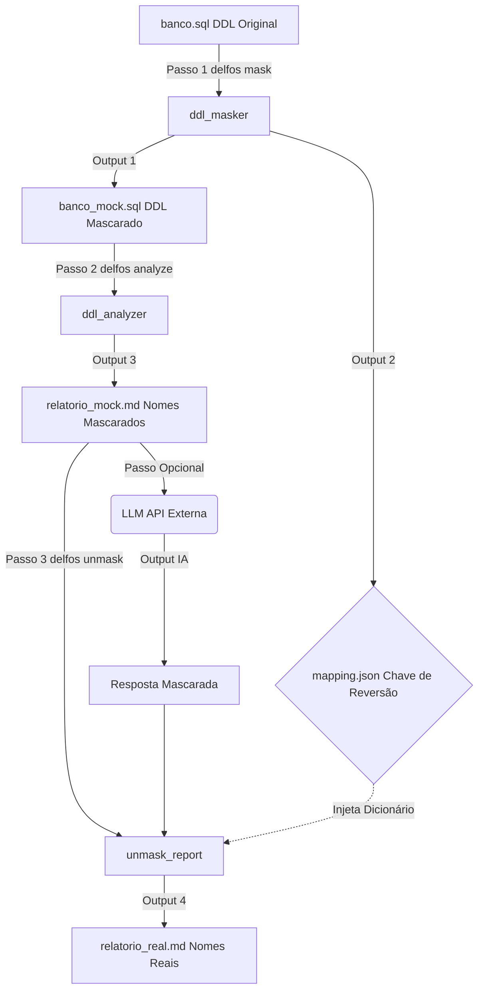

# Fluxo de Processamento do Delfos

```mermaid
graph TD
    A[banco.sql DDL Original] -->|Passo 1 delfos mask| B[ddl_masker]
    B -->|Output 1| C[banco_mock.sql DDL Mascarado]
    B -->|Output 2| D{mapping.json Chave de Reversão}
    C -->|Passo 2 delfos analyze| E[ddl_analyzer]
    E -->|Output 3| F[relatorio_mock.md Nomes Mascarados]
    F -->|Passo Opcional| G(LLM API Externa)
    G -->|Output IA| H[Resposta Mascarada]
    F -->|Passo 3 delfos unmask| I[unmask_report]
    H --> I
    D -.->|Injeta Dicionário| I
    I -->|Output 4| J[relatorio_real.md Nomes Reais]
```